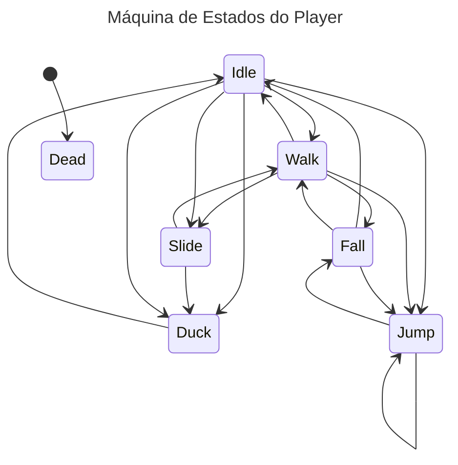

# GameGodotEngine

## Diagrama Máquina de Estado do Player

```mermaid
---
title: Máquina de Estados do Player
---
%%{init: {"theme": "hand-drawn"}}%%
stateDiagram-v2
    Idle --> Duck
    Idle --> Walk
    Idle --> Jump

    Duck --> Idle

    Slide --> Walk
    Slide --> Duck

    Walk --> Idle
    Walk --> Fall
    Walk --> Jump
    Walk --> Slide
    
    Jump --> Jump
    Jump --> Fall
    
    Fall --> Idle
    Fall --> Jump
    Fall --> Walk

    Idle --> Duck
    Idle --> Slide

	[*] --> Dead

```
